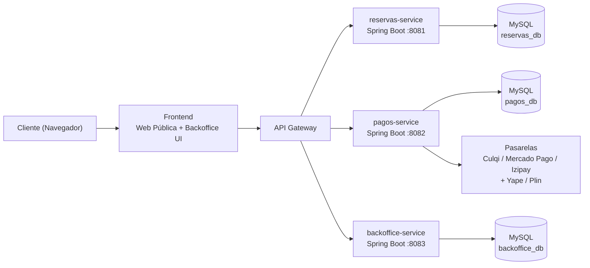

# Hotel Támpur — Arquitectura del Sistema

Sistema Web de Reservas y Gestión · Magnolias 197, San Mateo, Huarochirí, Lima (3,200 msnm)
Contacto: 943 370 504

## 1. Visión general

Arquitectura de **microservicios / backend modular** + **frontend desacoplado**.



## 2. Módulos

| Módulo | Servicio | Puerto | Responsabilidad |
|---|---|---|---|
| Frontend / Web Pública | `frontend/` (HTML + CSS + JS) | — | UI responsive: hero, catálogo, buscador, contacto, backoffice |
| Motor de Reservas | `backend/reservas-service` | 8081 | Disponibilidad en tiempo real, cálculo de costo, reservas |
| Servicio de Pagos | `backend/pagos-service` | 8082 | Pasarela de tarjetas, Yape/Plin, código único de reserva |
| Panel Administrativo | `backend/backoffice-service` | 8083 | Ocupación, limpieza, reportes de ingresos, bitácora |

## 3. Estructura del repositorio

```
HotelTampur/
├── frontend/
│   ├── index.html                 # Web pública + panel administrativo
│   ├── css/styles.css             # Estilos
│   ├── js/app.js                  # Lógica (reservas, pagos, backoffice)
│   └── assets/img/                # Imágenes
├── backend/
│   ├── reservas-service/          # Spring Boot :8081
│   ├── pagos-service/             # Spring Boot :8082
│   └── backoffice-service/        # Spring Boot :8083
└── docs/
    └── arquitectura.md
```

## 4. Endpoints principales

**reservas-service (8081)**
- `GET    /api/habitaciones` — catálogo de habitaciones
- `GET    /api/disponibilidad?fechaEntrada=&fechaSalida=` — habitaciones libres en el rango de fechas
- `POST   /api/reservas` — crea una reserva (calcula noches × tarifa)
- `GET    /api/reservas` — lista de reservas
- `GET    /api/reservas/{codigo}` — detalle por código
- `PATCH  /api/reservas/{codigo}/estado` — cambia el estado (Confirmada/Cancelada)
- `DELETE /api/reservas/{codigo}` — elimina una reserva

**pagos-service (8082)**
- `POST /api/pagos` — procesa pago (tarjeta/yape/plin) y genera voucher
- `GET  /api/pagos/{id}` — estado del pago

**backoffice-service (8083)**
- `GET   /api/ocupacion` — estado de habitaciones (Libre/Ocupada/Limpieza/Mantenimiento)
- `PATCH /api/ocupacion/{id}/estado` — cambia el estado de una habitación
- `GET   /api/limpieza` — habitaciones pendientes de limpieza hoy
- `PATCH /api/limpieza/{numero}/estado` — marca/desmarca una habitación como limpiada
- `GET   /api/reportes/ingresos` — ingresos diarios
- `GET   /api/reservas` — bitácora de reservas

## 5. Reglas de negocio

- Check-in: 1:00 p.m. · Check-out: 12:00 p.m.
- Habitaciones: Simple (S/90), Doble (S/140), Matrimonial (S/180)
- Cálculo: total = tarifa × número de noches
- Pago digital → `APROBADO`; pago por voucher (Yape/Plin) → `PENDIENTE_VOUCHER` hasta validación

## 6. Cómo ejecutar (desarrollo)

```bash
# Requiere JDK 21+ y Maven
cd backend/reservas-service && mvn spring-boot:run   # :8081
cd backend/pagos-service && mvn spring-boot:run      # :8082
cd backend/backoffice-service && mvn spring-boot:run # :8083
```

### Variables de entorno (correo SMTP)

`reservas-service` y `pagos-service` leen las credenciales de correo desde variables
de entorno (no se guardan contraseñas en el código):

```bash
export SMTP_USERNAME="tucorreo@gmail.com"
export SMTP_PASSWORD="tu-contrasena-de-aplicacion"
```

En Windows (PowerShell):

```powershell
$env:SMTP_USERNAME="tucorreo@gmail.com"
$env:SMTP_PASSWORD="tu-contrasena-de-aplicacion"
```

> Los servicios usan almacenamiento en memoria (listas) para la demo. En producción se
> reemplazan por MySQL/PostgreSQL con Spring Data JPA.
